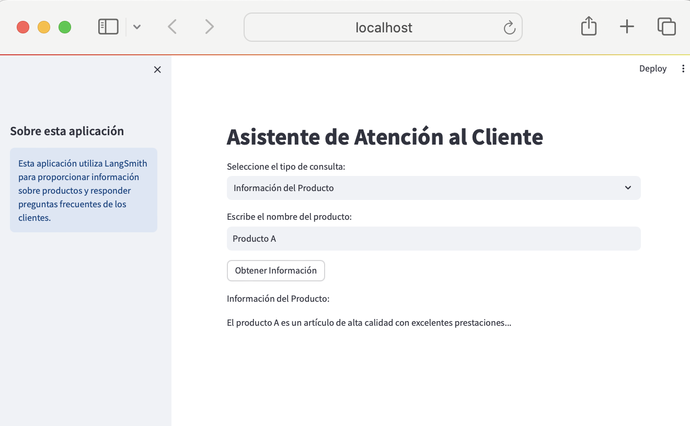

# Customer Service Wizard with LangSmith and Streamlit



This sample application demonstrates how to integrate LangSmith to provide answers to frequently asked questions and product information with a user interface created in Streamlit.

## Installation

1. Clone this repository.
2. Install the dependencies:

```bash
pip install -r requirements.txt
